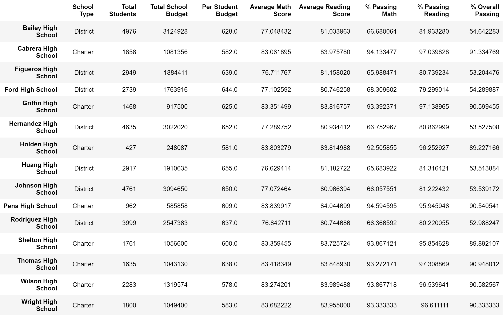
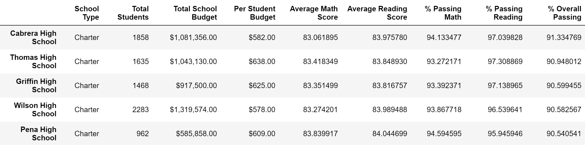
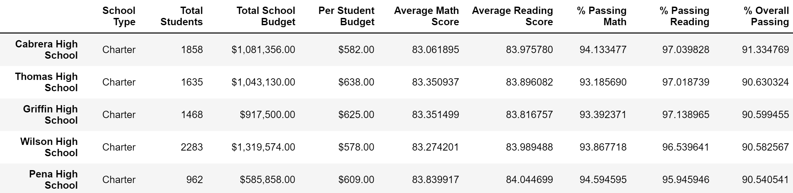
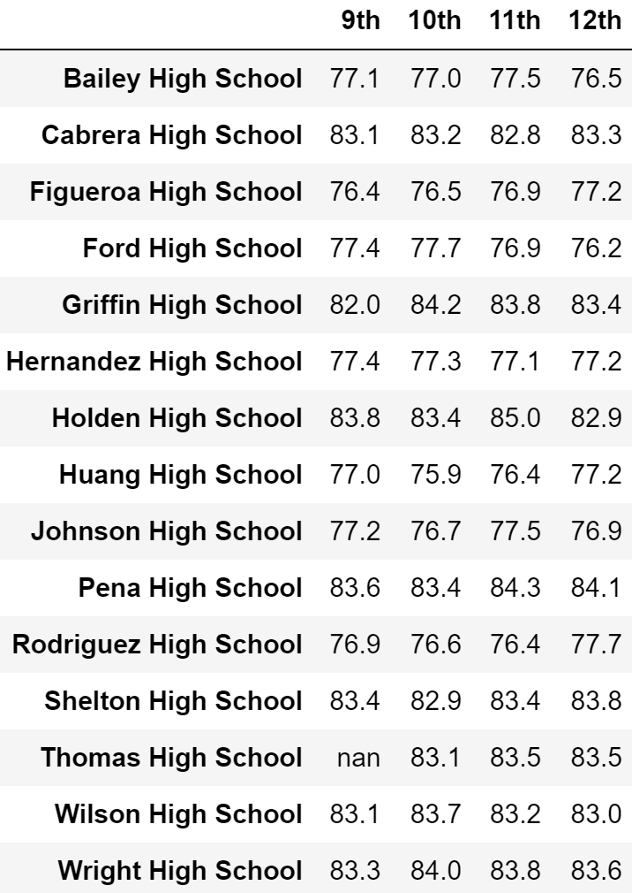
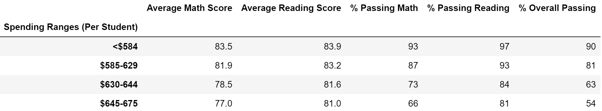
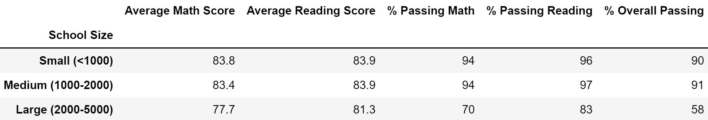
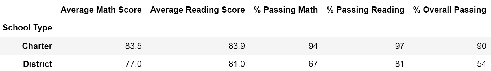

# School District Analysis

## Overview
### Background
The client for the current project is a Chief Data Scientist for a city school district. In a previous project for this client, standardized testing data was analyzed to provide insight into performance trends. Recently, the school board that the client reported to realized that the test results of the 9th grade at Thomas High School (THS) had appeared to have been altered. 

### Purpose
The purpose of the current project was to replace the test scores for the 9th grade students at THS with NaN ("not a number") while keeping the rest of the data intact. Once this was completed, the the data analysis was repeated in order to determine how this NaN change affected the results of the overall analysis. 

### Resources
- Data Sources
    - students_complete.csv
    - schools_complete.css
- Software
    - Jupyter Notebook
    - Python 3.7.10

## Results

- The district summary was only changed slightly by the replacement of the 9th Grade scores at THS with NaN. The largest change was in the percentage of students passing the reading test. This value decreased from 86% to 85.7%. 

    - *Original District Summary*
    
    
    - *Updated District Summary*
    
    
- Originally when the scores were replaced with NaN, there was a large decrease in passing percentages for THS. However, when the student count was adjusted to remove the 9th graders from the total count, the values rose to be similar to the original values.

    - *Original Per-School Summary*
    
    
    - *Immediately After Scores Replaced*
    
    
    - *Updated With Adjusted Student Count*
    
    
- Thomas High School's performance relative to the other schools in the district based on overall passing percentage did not change after replacing 9th grade scores with NaN. It remained in second place. 

    - *Original Ranking*
    
    
    - *Updated Ranking*
    
    
- When examining math and reading scores by grade, the 9th grade average for the tests was NaN. This can be seen in the example below showing the math score averages. 

    - *Updated Math Averages By Grade*
     
    
- For the following metrics, no change occurred after the replacement of 9th grade scores with NaN. (Note: Some values were technically different, but only by a few hundreths. This is not reflected as these differences did not affect the scores after rounding to the appropriate place value.) 

    - *Scores By School Spending*
    
    
    - *Scores By School Size*
    
    
    - *Scores By School Type*
    
    
## Summary 
Overall, replacing the 9th grade scores from Thomas High School with NaN did not cause large differences in the analysis. However, an overview of specific changes to the analysis results are noted below:

1. Within THS, the passing math percentage, passing reading percentage, and passing overall percentage decreased. 
2. The average math score at THS decreased, but the average reading score at THS *increased*. 
3. The district-wide average math score decreased, while the average reading score stayed the same. 
4. The district-wide passing math percentage, passing reading percentage, and passing overall percentage decreased. 
